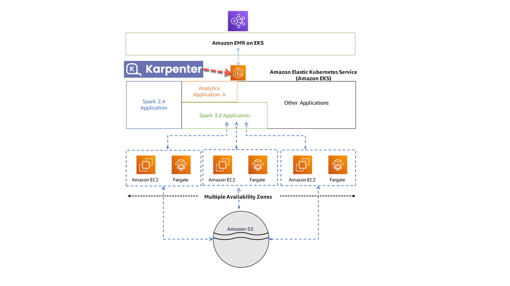

# EMR on EKS

## 视频

## 前提
需要一个Bash脚本的执行环境，并安装如下命令行工具：
- [AWS CLI](https://aws.amazon.com/cli/)
- [kubectl](https://kubernetes.io/docs/tasks/tools/#kubectl)
- [eksctl](https://docs.aws.amazon.com/eks/latest/userguide/getting-started-eksctl.html)
- [Helm](https://helm.sh/)
- [curl](https://curl.se/)
- [jq](https://stedolan.github.io/jq/)
- [xargs](https://man7.org/linux/man-pages/man1/xargs.1.html)

## 架构

## 执行步骤
按照脚本命名的编号顺序执行01到03就可以完成资源的部署和Spark Job提交，最后顺序执行97到99编号的脚本就可以清理所有的资源。

## 参考资源
- [EMR on EKS文档](https://docs.aws.amazon.com/emr/latest/EMR-on-EKS-DevelopmentGuide/emr-eks.html)
- [Karpenter官网](https://karpenter.sh/)
