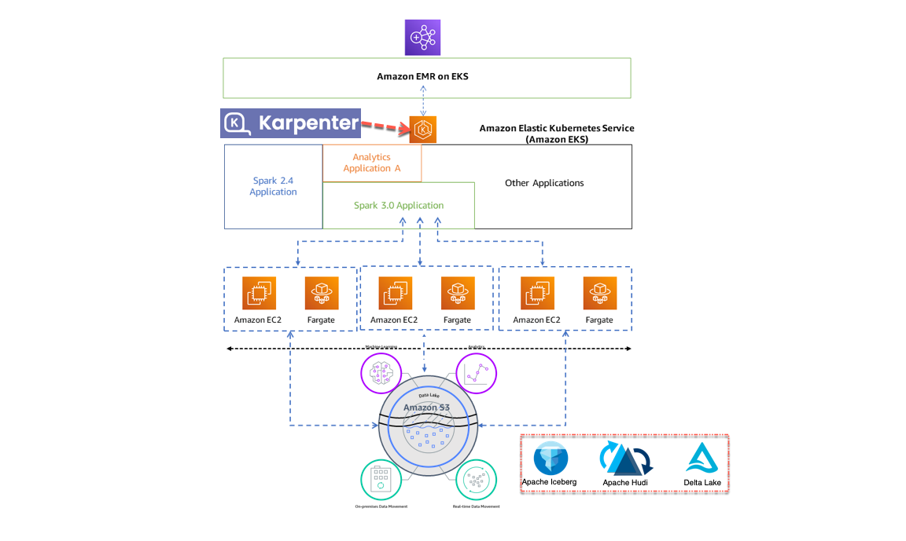

# EMR on EKS
上一期视频我们展示了如何快速搭建EMR on EKS，那么今天的视频就是在上一期的内容基础之上，看一下如何快速部署数据湖三剑客——Iceberg、Hudi和Delta Lake。

## 视频

## 前提
需要一个Bash脚本的执行环境，并安装如下命令行工具：
- [AWS CLI](https://aws.amazon.com/cli/)
- [kubectl](https://kubernetes.io/docs/tasks/tools/#kubectl)
- [eksctl](https://docs.aws.amazon.com/eks/latest/userguide/getting-started-eksctl.html)
- [Helm](https://helm.sh/)
- [curl](https://curl.se/)
- [jq](https://stedolan.github.io/jq/)
- [xargs](https://man7.org/linux/man-pages/man1/xargs.1.html)

## 架构

## 执行步骤
需要首先执行[01-eks-emr-example](01-eks-emr-example)目录下的01、02、03编号开头的脚本创建EMR on EKS集群，集群建成后按照脚本命名的编号顺序执行04到05就可以分别部署和执行Iceberg、hudi和Delta Lake数据湖，清理脚本请首先使用96编号的脚本清除数据湖任务的资源，最后顺序执行97到99编号的脚本就可以清理所有的资源。

## 参考资源
- [EMR on EKS文档](https://docs.aws.amazon.com/emr/latest/EMR-on-EKS-DevelopmentGuide/emr-eks.html)
- [Karpenter官网](https://karpenter.sh/)
- [Apache Iceberg](https://iceberg.apache.org/)
- [Apache Hudi](https://hudi.apache.org/)
- [Delta Lake](https://delta.io/)
