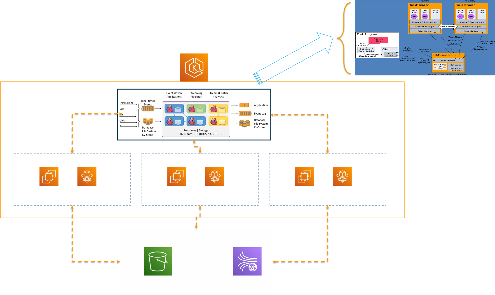

# Flink on EKS
在目前大数据的计算处理场景中通常会分为两大类：一类是批处理一类是流处理。作为开源大数据生态中成功的Spark，已经成为批处理场景下主要采用的开源框架，而近几年崛起的Flink就成为了流处理场景下的最佳选择。Apache Flink是一个框架和分布式处理引擎，可以在无边界和有边界数据流上进行有状态的计算。Flink能在所有常见集群环境中运行，并能在内存里、以任意规模进行计算。Flink官方支持的部署方式除了独立集群的方式以外还支持：Hadoop YARN、Apache Mesos和Kubernetes，而目前K8S作为基础架构容器化部署的流行方式，越来越受到企业级客户的青睐。在今天的视频中我会首先跟大家简单看一下架构和演示步骤，随后还是我们视频的主菜——代码部署、讲解和演示，其中就会快速使用写好的脚本部署一个Flink集群并提交测试的任务。
## 视频

## 前提
需要一个Bash脚本的执行环境，并安装如下命令行工具，其中在这次代码中的Java需要编译和打包：
- [AWS CLI](https://aws.amazon.com/cli/)
- [kubectl](https://kubernetes.io/docs/tasks/tools/#kubectl)
- [eksctl](https://docs.aws.amazon.com/eks/latest/userguide/getting-started-eksctl.html)
- [JRE](https://www.oracle.com/java/technologies/downloads/)
- [Maven](https://maven.apache.org/)

## 架构

## 执行步骤
按照脚本命名的编号顺序执行01到04就可以完成资源的部署和Flink Batch/Stream Job提交，最后顺序执行98到99编号的脚本就可以清理所有的资源。

## 参考资源
- [EKS文档](https://docs.aws.amazon.com/eks/latest/userguide/what-is-eks.html)
- [Flink文档](https://flink.apache.org/)
