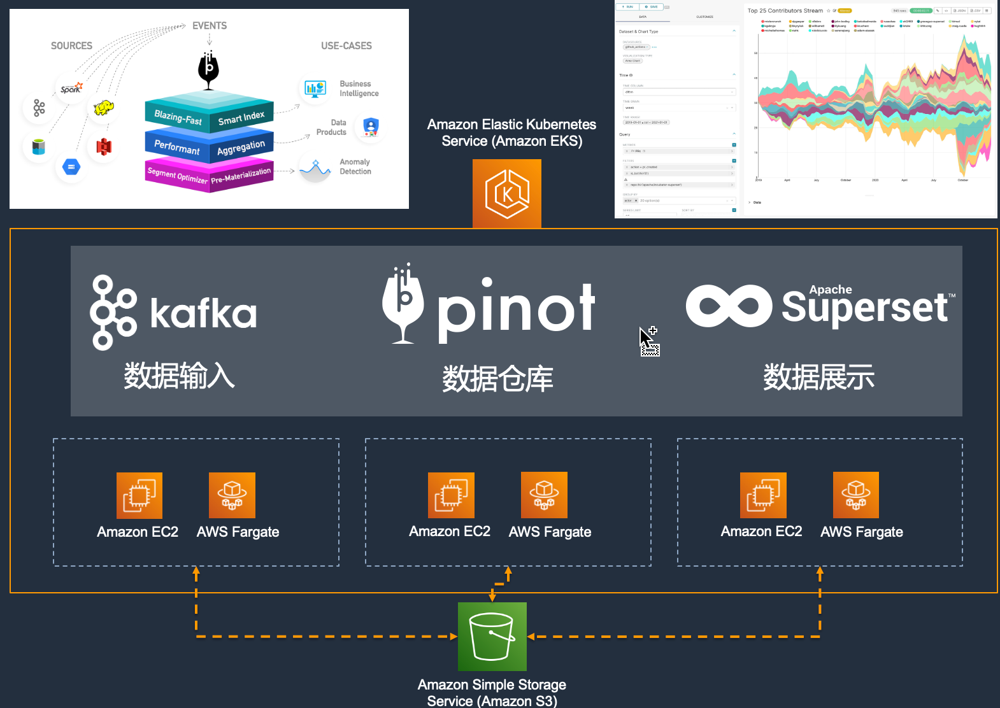
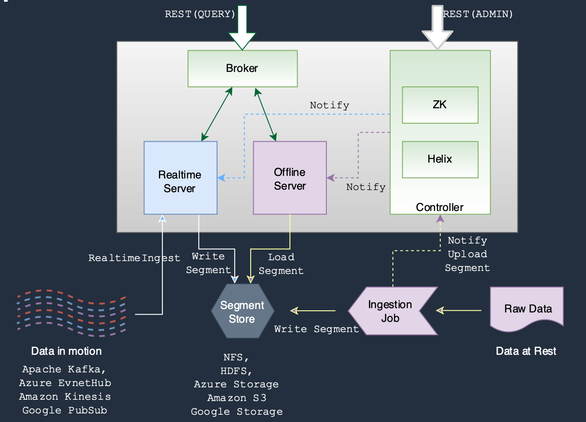

# Pinot Superset on EKS
开源项目是Pinot，应该是法语红酒的名字，Apache顶级项目，主要用于数仓OLAP的场景，它主要的特点是既支持离线数仓又支持实时数仓，可以让开发人员使用兼容SQL的方式联合查询离线存储和实时流式数据。这个项目是由LinkedIn创建的，但是目前在Uber、微软等大厂应用还是很广泛的。前面几期视频在EKS上聊过了批处理Spark、流处理Flink，它们通常是在ETL中使用，而在企业级数据应用场景中最终交付给用户的都是用BI报表的方式，这样开源的BI产品Superset就需要登场了，无论商业和开源的BI产品通常会使用数仓作为自己底层数据来源，并同时使用SQL语句降低开发门槛。当然使用Superset也可以直连Spark SQL或者Hive SQL类的Trino、Presto，甚至所谓湖仓一体的Databricks，但是由于一般的BI还是需要有Adhoc的查询的能力，对SQL语句返回的即时性要求很高，因此通常还是会用一个企业级数仓来进行支撑，这就是为什么使用了Pinot+Superset的组合来演示了。
## 视频

## 前提
需要一个Bash脚本的执行环境，并安装如下命令行工具，其中在这次代码中的Java需要编译和打包：
- [AWS CLI](https://aws.amazon.com/cli/)
- [kubectl](https://kubernetes.io/docs/tasks/tools/#kubectl)
- [eksctl](https://docs.aws.amazon.com/eks/latest/userguide/getting-started-eksctl.html)

## 架构
### 演示架构

### Pinot架构

## 执行步骤
按照脚本命名的编号顺序执行，其中01脚本会部署基础架构，02和03可以设置好Pinot并启动Pinot的Console来进行即时查询，04和05会设置好Superset并启动Superset的Web页面。最后顺序执行97到99编号的脚本就可以清理所有的资源。

## 参考资源
- [EKS文档](https://docs.aws.amazon.com/eks/latest/userguide/what-is-eks.html)
- [Pinot官网](https://pinot.apache.org/)
- [Superset官网](https://superset.apache.org)
